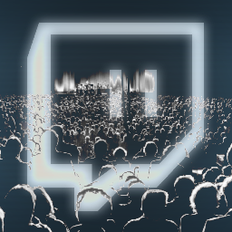

#  TwitchEvents for Farming Simulator 22
This mod enables integration with Twitch Events via WarpWorlds's CrowdControl client. You need to setup the CrowdControl client in order to use this mod.

## Installation

### FS22 Mod installation

1. Make sure that the game is not running while installing or updating mods.
2. Download the mod package `TwitchEvents.zip` from the latest [release](https://github.com/DerMitDemRolfTanzt/fs22-twitchevents/releases).
3. Drop the downloaded zip file (do not extract) to the FS22 mods folder `%USERPROFILE%\Documents\My Games\FarmingSimulator2022\mods`.

### CrowdControl installation

1. Download and install the latest CrowdControl Desktop client from https://crowdcontrol.live/.
2. Sign in with your Twitch account and enable the CrowdControl Twitch-Extension. See https://crowdcontrol.live/setup#heading--installExtension for more info.
3. If you want to enable ChannelPoints for CrowdControl effects, make sure to enable the custom ChannelPoint rewards as described in https://crowdcontrol.live/setup#heading--channelPoints.

### CrowdControl effect pack installation

1. Download the CrowdControl Effect Pack `fs22effectpack.ccpak` from the latest [release](https://github.com/DerMitDemRolfTanzt/fs22-twitchevents/releases).
2. In the CrowdControl Desktop Client navigate to "Game Selection" and select the Game "Crowd Control Custom Game Pak (Beta)".
3. Click on "Load Pak" and select the downloaded `fs22effectpack.ccpak` file.
4. Click on "Edit Menu" to enable / disable effects and customize prices and icons. Click on "Save" to confirm your changes and close the menu editor.
5. Click on "Start" to connect to the game.

_(Although the CrowdControl client will always show successful connection status, the effects won't work unless the game is running and the FS22 Mod is enabled.)_

## Status
This mod is in a very early stage of development. Use at your own risk!

- [x] Multiplayer support
- [x] Visual effects
- [x] Gameplay effects
- [ ] Effect Cost Balancing
- [ ] Effect Duration Balancing

## Supported Effects
* `debug`: Print a debug message on screen
* `invisiblevehicle`: Hide the currently controlled vehicle for a few seconds
* `topdown`: Force Top-Down Camera for a few seconds
* `invertcontrols`: Invert left/right axis controls for a few seconds
* `upsidedown`: Rotate camera by 180 degrees for a few seconds
* `repairvehicle`: Repair the currently controlled vehicle
* `damagevehicle`: Damage the currently controlled vehicle

## License
This library is free software; you can redistribute it and/or modify it under
the terms of the MIT license. See [LICENSE](LICENSE) for details.
